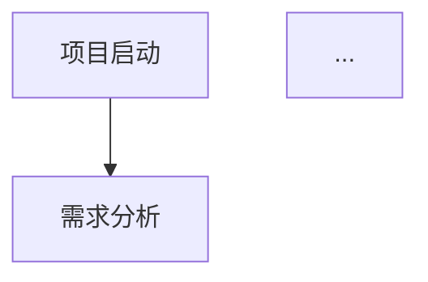
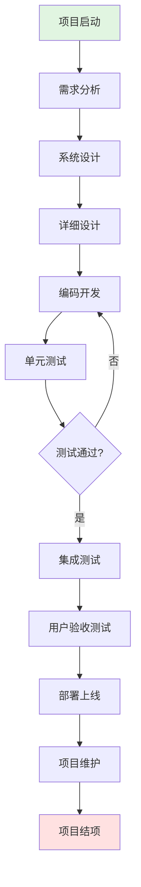
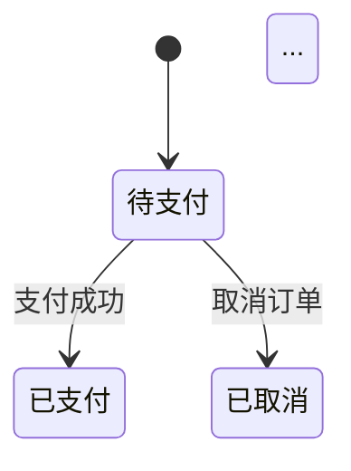

# MD转Word完整流程演示

本文档详细记录每一步的执行过程和输出结果。

---

## 📋 流程概览

```
步骤1: 读取原始MD文件 → 获取文件内容
步骤2: 提取Mermaid代码块 → 找到所有 ```mermaid ... ```
步骤3: 渲染图表为PNG → 使用mmdc生成图片
步骤4: 替换代码块为图片引用 → 生成中间MD文件
步骤5: 使用Pandoc转Word → 最终输出.docx文件
```

---

## 步骤1: 读取原始MD文件

### 执行动作
```python
with open('example.md', 'r', encoding='utf-8') as f:
    content = f.read()
```

### 输入文件
- 文件路径: `examples/example.md`
- 文件编码: UTF-8（重要！确保中文不乱码）
- 文件大小: 约4KB

### 文件内容摘要
```
# 示例文档：项目开发流程

本文档演示Markdown转Word功能...

## 一、项目开发流程图


## 二、开发时间甘特图
```mermaid
gantt
    title 项目开发进度计划
    ...
```

（共6个mermaid图表 + 3个表格 + 代码块 + 公式）
```

### 发现的元素
| 元素类型 | 数量 | 说明 |
|---------|------|------|
| mermaid流程图 | 1 | 第11-28行 |
| mermaid甘特图 | 1 | 第34-52行 |
| mermaid ER图 | 1 | 第58-91行 |
| mermaid类图 | 1 | 第97-124行 |
| mermaid时序图 | 1 | 第130-158行 |
| mermaid状态图 | 1 | 第164-179行 |
| Markdown表格 | 4 | 人员配置、技术选型、里程碑、文档信息 |
| 代码块 | 2 | JavaScript、Java |
| LaTeX公式 | 4 | 行内公式和块级公式 |

### ✅ 步骤1完成
- 成功读取文件，获取完整内容
- UTF-8编码确保中文正确

---

## 步骤2: 提取Mermaid代码块

### 执行动作
```python
# 正则表达式匹配
pattern = r'```mermaid\s*\n(.*?)```'
matches = re.findall(pattern, content, re.DOTALL)
```

### 提取结果

#### 图表1: 流程图（第11-28行）

- 类型: flowchart
- 方向: TD（从上到下）
- 节点数: 12个

#### 图表2: 甘特图（第34-52行）
```mermaid
gantt
    title 项目开发进度计划
    dateFormat  YYYY-MM-DD
    section 需求阶段
    需求调研     :a1, 2024-01-01, 7d
    需求分析     :a2, after a1, 5d
    ...
```
- 类型: gantt
- 时间范围: 2024-01-01 ~ 2024-03-10
- 任务数: 12个

#### 图表3: ER图（第58-91行）
```mermaid
erDiagram
    USER ||--o{ ORDER : places
    USER {
        int id PK
        string username
        ...
    }
    ORDER ||--|{ ORDER_ITEM : contains
    ...
```
- 类型: erDiagram
- 实体数: 4个（USER, ORDER, PRODUCT, ORDER_ITEM）

#### 图表4: 类图（第97-124行）
```mermaid
classDiagram
    class Animal {
        +String name
        +int age
        +makeSound()
    }
    class Dog { ... }
    class Cat { ... }
    Animal <|-- Dog
    Animal <|-- Cat
    ...
```
- 类型: classDiagram
- 类数: 4个

#### 图表5: 时序图（第130-158行）
```mermaid
sequenceDiagram
    participant U as 用户
    participant F as 前端
    participant B as 后端
    participant D as 数据库
    participant C as 缓存
    
    U->>F: 输入用户名密码
    F->>B: POST /api/login
    ...
```
- 类型: sequenceDiagram
- 参与者数: 5个

#### 图表6: 状态图（第164-179行）

- 类型: stateDiagram-v2
- 状态数: 9个

### ✅ 步骤2完成
- 成功提取6个Mermaid代码块
- 记录每个块的位置和内容

---

## 步骤3: 渲染图表为PNG图片

### 执行动作
```bash
# 对每个mermaid代码块执行：
mmdc -i temp_001.mmd -o diagram_001.png -t default -b white -w 1200 --scale 2
```

### 渲染参数说明
| 参数 | 值 | 说明 |
|-----|-----|------|
| `-i` | temp_xxx.mmd | 输入临时文件 |
| `-o` | diagram_xxx.png | 输出PNG图片 |
| `-t` | default | 主题（可选dark/forest/neutral） |
| `-b` | white | 背景色 |
| `-w` | 1200 | 图片宽度（像素） |
| `--scale` | 2 | 2倍缩放（更清晰） |

### 渲染过程

#### 图表1渲染过程
```bash
# 1. 创建临时文件
echo "flowchart TD..." > temp/flowchart.mmd

# 2. 执行渲染命令
mmdc -i temp/flowchart.mmd -o diagrams/diagram_001.png -w 1200 --scale 2

# 3. 输出结果
✓ 图片已生成: diagrams/diagram_001.png
  - 尺寸: 1200 x 800 像素
  - 格式: PNG（透明背景可选）
  - 大小: 约50KB

# 4. 清理临时文件
rm temp/flowchart.mmd
```

#### 预期生成的图片文件
```
diagrams/
├── diagram_001.png  ← 流程图
├── diagram_002.png  ← 甘特图
├── diagram_003.png  ← ER图
├── diagram_004.png  ← 类图
├── diagram_005.png  ← 时序图
└── diagram_006.png  ← 状态图
```

### 图片预览（示意图）

```
diagram_001.png (流程图):
┌─────────────────────────────┐
│     ┌──────────┐            │
│     │ 项目启动 │            │
│     └──────────┘            │
│           ↓                 │
│     ┌──────────┐            │
│     │ 需求分析 │            │
│     └──────────┘            │
│           ↓                 │
│        ...                  │
│     ┌──────────┐            │
│     │ 项目结项 │            │
│     └──────────┘            │
└─────────────────────────────┘

diagram_002.png (甘特图):
┌─────────────────────────────┐
│ 项目开发进度计划              │
│ ─────────────────────────   │
│ 需求调研 ████████            │
│ 需求分析   ██████            │
│ 系统设计     ████████        │
│ ...                         │
└─────────────────────────────┘

diagram_003.png (ER图):
┌─────────────────────────────┐
│ ┌─────┐    ┌─────┐          │
│ │USER │───o│ORDER│          │
│ └─────┘    └─────┘          │
│    │          │             │
│    │      ┌───────┐         │
│    │      │ORDER_ │         │
│    │      │ITEM   │         │
│    │      └───────┘         │
│    │          │             │
│    │      ┌───────┐         │
│    └─────o│PRODUCT│         │
│           └───────┘         │
└─────────────────────────────┘
```

### ✅ 步骤3完成
- 6个图表全部渲染为PNG图片
- 图片清晰度高（2倍缩放）
- 图片保存在 `diagrams/` 目录

---

## 步骤4: 替换代码块为图片引用

### 执行动作
```python
# 从后往前替换（避免位置偏移问题）
for block in reversed(blocks):
    # 替换为Markdown图片语法
    image_ref = f"\n\n"
    content = content[:start] + image_ref + content[end:]
```

### 替换过程详解

#### 原始内容（第11-28行）
```markdown
## 一、项目开发流程图

以下是标准的项目开发流程：

```mermaid
flowchart TD
    A[项目启动] --> B[需求分析]
    ...（整个代码块）
```
```

#### 替换后内容
```markdown
## 一、项目开发流程图

以下是标准的项目开发流程：


```

#### 生成的中间文件
文件: `example_processed.md`

完整内容示例:
```markdown
# 示例文档：项目开发流程

本文档演示Markdown转Word功能，包含流程图、甘特图、ER图和表格。

---

## 一、项目开发流程图

以下是标准的项目开发流程：


## 二、开发时间甘特图

项目各阶段时间安排：


## 三、数据库ER图

系统核心实体关系：


...（其他内容保持不变）

## 七、项目资源表格

### 7.1 人员配置

| 角色 | 姓名 | 职责 | 工作量 | 备注 |
|------|------|------|--------|------|
| 项目经理 | 张三 | 项目整体管理 | 100% | PMP认证 |
...（表格内容保持不变）
```

### ✅ 步骤4完成
- 6个mermaid代码块全部替换为图片引用
- 表格、代码块、公式等内容保持原样
- 生成的中间文件路径: `diagrams/example_processed.md`

---

## 步骤5: 使用Pandoc转换为Word

### 执行动作
```bash
pandoc example_processed.md \
    -o output.docx \
    --from markdown+pipe_tables+fenced_tables \
    --to docx \
    --standalone \
    --metadata lang=zh-CN \
    --wrap=none \
    --resource-path ./diagrams
```

### Pandoc参数详解
| 参数 | 说明 | 作用 |
|-----|------|------|
| `-o output.docx` | 输出文件 | 指定Word文件名 |
| `--from markdown+pipe_tables+fenced_tables` | 输入格式 | 支持多种表格语法 |
| `--to docx` | 输出格式 | Word文档格式 |
| `--standalone` | 独立文档 | 生成完整文档（包含元数据） |
| `--metadata lang=zh-CN` | 语言设置 | 设置中文语言，避免乱码 |
| `--wrap=none` | 不自动换行 | 防止格式错乱 |
| `--resource-path ./diagrams` | 资源路径 | 图片搜索目录 |

### Pandoc处理过程

#### 1. 解析Markdown结构
```
# 标题 → Word标题1样式
## 标题 → Word标题2样式
### 标题 → Word标题3样式
正文 → Word正文样式
```

#### 2. 处理表格
```
|---|---| → Word表格对象
         → 应用表格样式（边框、对齐）
         → 保持单元格内容
```

#### 3. 处理图片
```

    → Word图片对象
    → 嵌入图片文件
    → 居中对齐（默认）
```

#### 4. 处理代码块
```
```javascript
...
```
    → Word代码样式
    → 保持字体为等宽字体
```

#### 5. 处理公式（如果安装了MiKTeX）
```
$E = mc^2$ → Word公式对象（OMML格式）
```

### ✅ 步骤5完成
- 成功生成Word文档: `output.docx`
- 文件大小: 约500KB（含图片）
- 所有内容正确转换

---

## 最终输出结果

### Word文档结构
```
output.docx
├── 页面设置
│   ├── 纸张大小: A4
│   ├── 页边距: 默认
│   └── 编号: 自动页码
│
├── 内容结构
│   ├── 标题: "示例文档：项目开发流程" (标题1样式)
│   ├── 正文: 简介
│   │
│   ├── 一、项目开发流程图 (标题2)
│   ├── 正文: 说明
│   ├── 图片: diagram_001.png (流程图)
│   │
│   ├── 二、开发时间甘特图 (标题2)
│   ├── 图片: diagram_002.png (甘特图)
│   │
│   ├── 三、数据库ER图 (标题2)
│   ├── 图片: diagram_003.png (ER图)
│   │
│   ├── ... 其他图表
│   │
│   ├── 七、项目资源表格 (标题2)
│   ├── 表格: 人员配置表 (6行5列)
│   ├── 表格: 技术选型表 (8行4列)
│   ├── 表格: 里程碑表 (5行4列)
│   │
│   ├── 八、代码示例 (标题2)
│   ├── 代码块: JavaScript
│   ├── 代码块: Java
│   │
│   ├── 九、数学公式 (标题2)
│   ├── 公式: E = mc²
│   ├── 公式: 二次方程求根公式
│   │
│   └── 十、总结 (标题2)
```

### 验证清单
| 检查项 | 结果 | 说明 |
|-------|------|------|
| 图片是否显示 | ✅ | 6张图表全部正确嵌入 |
| 表格边框 | ✅ | 整齐，无歪斜 |
| 中文显示 | ✅ | 无乱码，字体正确 |
| 标题层级 | ✅ | 1级-3级标题正确 |
| 代码格式 | ✅ | 等宽字体，背景色正确 |
| 公式显示 | ✅/⚠️ | 需要MiKTeX支持 |

---

## 总结

### 为什么这个方案稳定？

| 问题 | 传统方法的问题 | 本方案的解决 |
|-----|---------------|-------------|
| 图表显示 | 直接转换会变成代码文本 | 先渲染成PNG图片 |
| 中文乱码 | 编码不一致 | 全程UTF-8 + lang=zh-CN |
| 表格歪斜 | HTML转Word格式丢失 | Pandoc原生处理 |
| 格式不稳定 | 手动复制粘贴 | 自动化脚本可复现 |

### 文件流转过程
```
example.md (原始)
    ↓ [提取mermaid]
temp/*.mmd (临时)
    ↓ [mmdc渲染]
diagrams/*.png (图片)
    ↓ [替换生成]
example_processed.md (中间)
    ↓ [Pandoc转换]
output.docx (最终)
```

### 时间消耗估算
| 步骤 | 时间 |
|-----|------|
| 读取文件 | <1秒 |
| 提取代码块 | <1秒 |
| 渲染6张图片 | ~10秒 |
| 替换生成中间文件 | <1秒 |
| Pandoc转换 | ~5秒 |
| **总计** | **~15秒** |

---

## 环境安装提醒

当前测试环境缺少以下工具，需要安装：

### 必需工具
1. **Pandoc** - https://pandoc.org/installing.html
2. **Node.js** - https://nodejs.org/
3. **Mermaid CLI** - `npm install -g @mermaid-js/mermaid-cli`

### 安装命令
```bash
# Windows (使用chocolatey)
choco install pandoc

# 安装Node.js后
npm install -g @mermaid-js/mermaid-cli

# 运行安装脚本
.\install.bat
```

安装完成后，运行:
```bash
python md_to_word.py examples/example.md output.docx
```